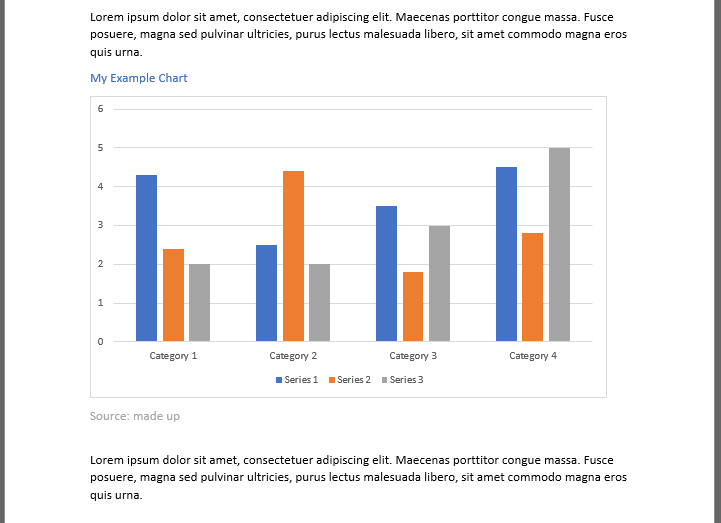
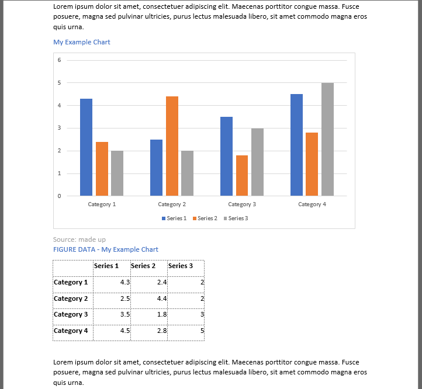
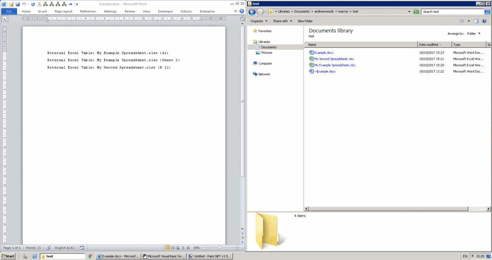

# doc-macros
macros to help process word documents 

## ExtractFigureData.bas

This Word macro loops through every chart object in the document and inserts the object's chart data after the chart.

The "Table Header" Style must exist.  The chart block, including any source declaration etc should be followed by an empty line.

### Before

### After

## ReplaceChartsWithImages.bas

This Word macro loops _backwards_ through every chart object and replaces it with an image.

## ExternalExcelTables.bas

Finds the string:

External Excel Table: _Some File Name_ {_some sheet name_}

and inserts the specified sheet.  The file name can be different on each include line.

The macro expects th table title to be in cell A1 and the data to start in cell A2

If you were to turn on screen updating as you run the macro, it would look something like this:

With this macro I recommend saving and closing everything you have open in Word and Excel, then opening the Word doc you wish to run the macro from.  Also it is recommended to change the view to draft so Word doesn't continually try to repaginate.
